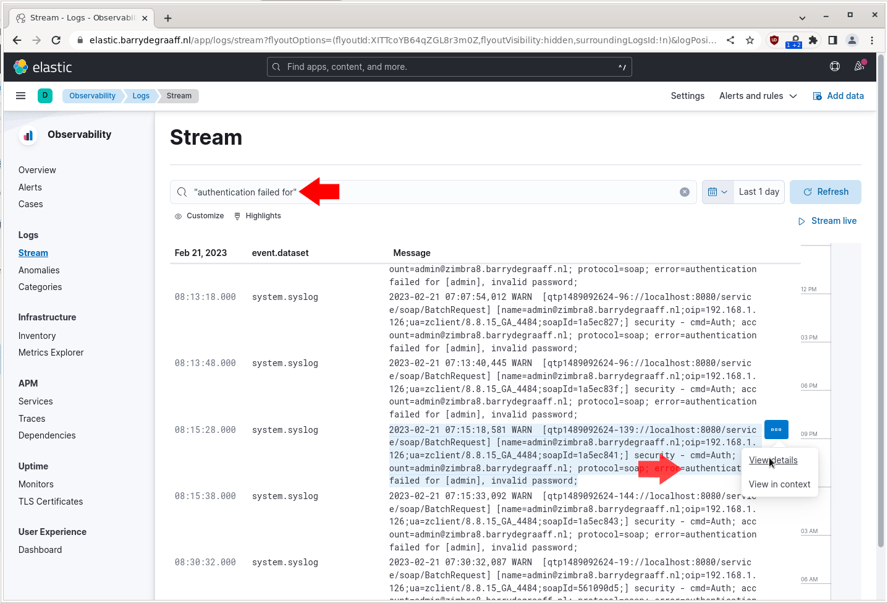
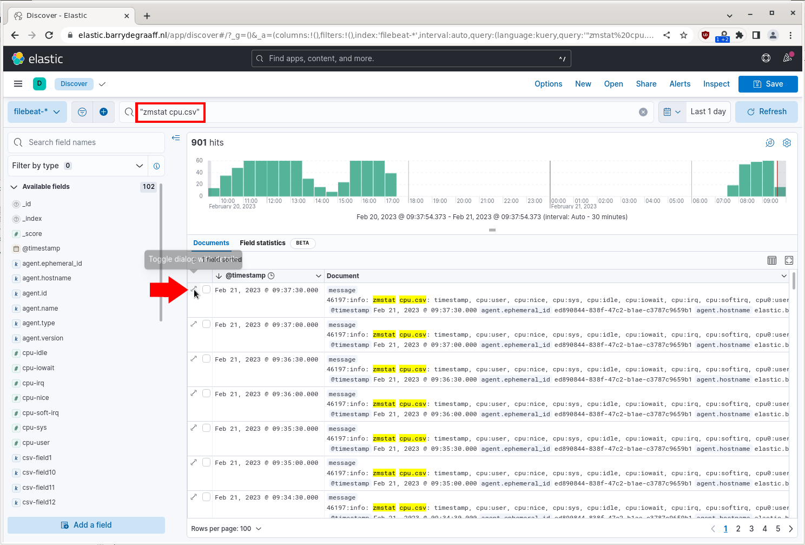
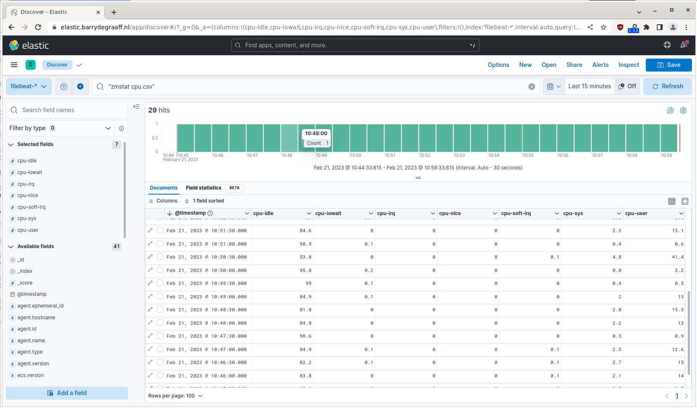
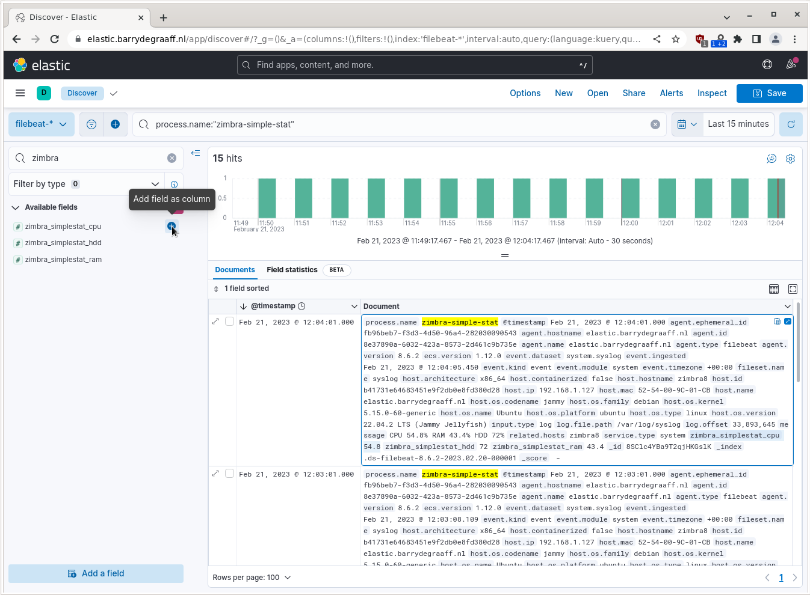

# Zimbra Elastic Stack

This guide describes how to use Elastic Stack with Zimbra by using Centralized Logging based on RSyslog. The main benefits of using Elastic Stack combined with Centralized Logging:
 
* Makes it easy to search through and analyze historic logs.
* Visualization of log events to gather insights.
* Storing of logs for forensic research in case of getting hacked.
* Uptime and certificate monitoring.

Both Zimbra and Elastic Stack consist of many components. The below diagram gives an overview of how the software components work together to make visualizations from raw log files. In the most simple form you can install Zimbra in a single server set-up and add another server for all the Elastic Stack components. Of course, if you plan to scale up you may split several of the software components across more virtual machines as required.

> 
*Example of a Zimbra Cluster with Elastic Stack and RSyslog.*

A basic Kibana dashboard for a Zimbra server would look like this:

> 
*Example Elastic Stack Dashboard on a Zimbra 9 installation.*

Without Elastic Stack your server only keeps the most recent log files of all the events happening on your Zimbra server. Even though you can configure your system logging to delay the compression and purging of log files, eventually log files tend to become very large and there are several log files for the various components in the system. Finding a specific event across all these logs can be time consuming.

Logs that are parsed by Elastic Stack become searchable, so you don't have to do all sorts of command line tricks to search for events quickly and go back in time without spending extended periods of time waiting for search results.

In addition to the search, Elastic Stack allows you to create visualizations in a relatively easy way. This way you can get insights into the vital parameters of your system, including but not limited to Postfix e-mail traffic, spam filtering, disk usage and load, CPU and RAM usage, and security related events such as failed web-UI log-ins, failed SSH login attempts, IMAP and SMTP brute force attempts etc. In time this can help you to become proactive in dealing with system load issues and security threats.

Using RSyslog to gather the logs of your Zimbra servers has a number of benefits over using Elastic stack mechanisms to gather logs:

* No need to install Elastic Stack agent on your Zimbra servers.
* Avoid 3rd party software repositories on your Zimbra servers.
* RSyslog centralized logging will secure your logs in case your server logs become compromised because of hacking.
* RSyslog centralized logging is an industry standard for securing logs for forensic researchers.
* Maintainability.

With regards to maintainability, Elastic Stack is DevOps developed software. While there is nothing wrong with that, over time things tends to change a lot. This means the mechanisms (Logstash Forwarder/Filebeat) offered for gathering logs can change significantly. For example Logstash Forwarder is now deprecated and the configuration options for Filebeat change often, making it challenging to maintain, especially if you run a Zimbra cluster. 

Please note that most of the config files and scripts that are in this guide are available in the Github repository. So if copy-pasting directly from this guide  does not work, you should retrieve the config files and scripts by downloading them via Github.

## Hardware and Software considerations

You will need one additional virtual machine that will serve as the RSyslog logging server and the Elastic Stack server. You can optionally split the two but this is not really needed and not described in this guide. You will have to pick an operating system that is both supported by RSyslog and Elastic Stack. The instructions in this guide are for Ubuntu 20.04 LTS. In detail:

- OS: Ubuntu 20.04 LTS
- RAM: 4GB
- CPU: 2
- Disk: 100GB (SSD preferred)

Please note that the logging tends to consume a large amount of disk space, so even though you can start from a smaller disk you need a solution that allows you to grow your disk over time, you can also archive your entire Elastic Stack periodically and revert to an clean snapshot on a yearly basis.

## Installing the Centralized Log Server

On the Ubuntu 20 server where we will install the Central Logging server and Elastic Stack, make sure to install all updates by running:

      apt update && apt upgrade
      reboot

In this guide we will set-up the RSyslog server to force the use of TLS so that our logs are transmitted over an encrypted connection. In case you are running your servers on an isolated network, you can opt to skip the TLS configuration. Please be advised that in case you first use RSyslog without TLS and then add it later, Zimbra/mailboxd does not recognize it. You will need to restart Zimbra to make it resume communications with RSyslog. If you do not restart Zimbra you will lose mailbox logs.

### Server/client terminology

In the paragraphs that describe RSyslog installation the term _server_ is used to designate the RSyslog server. In other words the RSyslog server is what receives logs. The term _client_ is used for the server that is sending the logs to RSyslog. So the Zimbra server is an RSyslog _client_.

### Install the necessary packages

      apt install -y rsyslog rsyslog-gnutls gnutls-bin haveged

### Create the TLS certificates for RSyslog server and client

You will notice the use of the same name for the client and server, you can use different names to create a more secure set-up.

      mkdir  /etc/rsyslog-certs
      cd /etc/rsyslog-certs
      
      certtool --generate-privkey --outfile ca-key.pem
         Generating a 3072 bit RSA private key...

      certtool --generate-self-signed --load-privkey ca-key.pem --outfile ca.pem
         Generating a self signed certificate...
         Please enter the details of the certificate's distinguished name. Just press enter to ignore a field.
         Common name: elastic.barrydegraaff.tk
         UID: 
         Organizational unit name: 
         Organization name: 
         Locality name: 
         State or province name: 
         Country name (2 chars): 
         Enter the subject's domain component (DC): 
         This field should not be used in new certificates.
         E-mail: 
         Enter the certificate's serial number in decimal (123) or hex (0xabcd)
         (default is 0x5bf740ed0e28daae2913f2fe8d1eabd00b58cb16)
         value: 
         
         Activation/Expiration time.
         The certificate will expire in (days): 3650
         
         Extensions.
         Does the certificate belong to an authority? (y/N): y
         Path length constraint (decimal, -1 for no constraint): 
         Is this a TLS web client certificate? (y/N): 
         Will the certificate be used for IPsec IKE operations? (y/N): 
         Is this a TLS web server certificate? (y/N): 
         Enter a dnsName of the subject of the certificate: 
         Enter a URI of the subject of the certificate: 
         Enter the IP address of the subject of the certificate: 
         Enter the e-mail of the subject of the certificate: 
         Will the certificate be used for signing (required for TLS)? (Y/n):  
         Will the certificate be used for data encryption? (y/N): 
         Will the certificate be used to sign OCSP requests? (y/N): 
         Will the certificate be used to sign code? (y/N): 
         Will the certificate be used for time stamping? (y/N): 
         Will the certificate be used for email protection? (y/N): 
         Will the certificate be used to sign other certificates? (Y/n):  
         Will the certificate be used to sign CRLs? (y/N): 
         Enter the URI of the CRL distribution point: 
         X.509 Certificate Information:
            Version: 3
            Serial Number (hex): 5bf740ed0e28daae2913f2fe8d1eabd00b58cb16
            Validity:
               Not Before: Mon Apr 12 08:12:54 UTC 2021
               Not After: Thu Apr 10 08:13:02 UTC 2031
            Subject: CN=elastic.barrydegraaff.tk
            Subject Public Key Algorithm: RSA
            Algorithm Security Level: High (3072 bits)
               Modulus (bits 3072):
                  00:ce:a1:a8:ca:b0:88:aa:aa:f3:95:f9:bc:3d:39:0d
                  42:ee:f2:5c:7a:bc:af:28:16:3f:0b:3e:3e:2e:f1:b0
                  f3:60:5c:ca:1c:da:22:6e:69:05:8b:e7:a4:33:73:cd
                  26:36:3f:ca:91:9c:9d:5b:f7:fa:5c:b5:87:12:ad:29
                  31:e9:be:5e:32:76:64:7b:88:8e:30:77:0b:81:6f:93
                  71:ea:2e:4a:e0:11:d0:ce:96:88:b1:0a:3a:ec:dc:d3
                  d1:b3:70:9a:55:be:5b:22:4d:d1:53:74:85:54:3f:84
                  15:9f:0c:a3:78:ac:ce:0f:e1:18:53:11:ed:49:dc:65
                  91:af:3a:9d:73:b9:50:5c:7e:4c:61:bd:c9:59:c0:31
                  59:72:70:0e:20:e6:cb:cf:75:de:32:51:47:66:b3:23
                  36:cc:2b:59:1d:8e:92:81:fb:18:b1:da:1e:b8:30:5c
                  41:04:d5:dc:c9:a9:79:4f:c4:05:5b:45:f6:5f:46:3d
                  44:1e:79:97:a4:bd:3f:d3:e7:18:f0:aa:89:5e:2c:43
                  1e:28:ef:f1:2f:7f:39:36:5e:da:1a:e4:52:54:6f:84
                  d2:92:e8:af:ea:b4:51:37:04:95:67:07:49:63:62:8c
                  8a:b9:c9:9a:54:46:32:d3:21:e8:2f:dd:03:88:d5:55
                  e0:ae:98:4a:48:c1:11:d0:7c:4a:96:be:b1:2d:ac:e6
                  0f:96:05:67:41:d7:d3:34:c9:ba:46:12:50:a6:02:4e
                  2a:64:21:7e:ae:ac:37:72:3e:18:0f:8d:2f:f3:ab:d4
                  ec:98:8e:b5:6f:ee:21:95:d1:9a:5b:bb:eb:a9:47:eb
                  74:b7:5e:9e:98:7f:7c:ac:eb:37:bb:fd:cf:bf:4a:b6
                  e1:f1:60:37:08:c7:3c:71:f0:6d:13:db:d1:f8:ba:ec
                  4a:1f:9c:c6:6d:92:02:26:ae:e2:f8:93:3f:87:9c:c1
                  0f:ad:ac:82:7d:8f:60:7f:99:ff:2d:6a:a6:de:39:11
                  2f
               Exponent (bits 24):
                  01:00:01
            Extensions:
               Basic Constraints (critical):
                  Certificate Authority (CA): TRUE
               Key Usage (critical):
                  Digital signature.
                  Certificate signing.
               Subject Key Identifier (not critical):
                  87ad4c435065629d69725be0198370ed013880a1
         Other Information:
            Public Key ID:
               sha1:87ad4c435065629d69725be0198370ed013880a1
               sha256:84cd614abfed8d7247ec47bac7561dc4e7aa40ad181a0d9f564d4560122b8313
            Public Key PIN:
               pin-sha256:hM1hSr/tjXJH7Ee6x1YdxOeqQK0YGg2fVk1FYBIrgxM=
         
         Is the above information ok? (y/N): y
         
         Signing certificate...

      certtool --generate-privkey --outfile rslclient-key.pem --bits 2048
         ** Note: You may use '--sec-param Medium' instead of '--bits 2048'
         Generating a 2048 bit RSA private key..

      certtool --generate-request --load-privkey rslclient-key.pem --outfile request.pem
         Generating a PKCS #10 certificate request...
         Common name: elastic.barrydegraaff.tk
         Organizational unit name: 
         Organization name: 
         Locality name: 
         State or province name: 
         Country name (2 chars): 
         Enter the subject's domain component (DC): 
         UID: 
         Enter a dnsName of the subject of the certificate: elastic.barrydegraaff.tk
         Enter an additional dnsName of the subject of the certificate: 
         Enter a URI of the subject of the certificate: 
         Enter the IP address of the subject of the certificate: 
         Enter the e-mail of the subject of the certificate: 
         Enter a challenge password: 
         Does the certificate belong to an authority? (y/N): 
         Will the certificate be used for signing (DHE ciphersuites)? (Y/n): 
         Will the certificate be used for encryption (RSA ciphersuites)? (Y/n): 
         Will the certificate be used to sign code? (y/N): 
         Will the certificate be used for time stamping? (y/N): 
         Will the certificate be used for email protection? (y/N): 
         Will the certificate be used for IPsec IKE operations? (y/N): 
         Will the certificate be used to sign OCSP requests? (y/N): 
         Is this a TLS web client certificate? (y/N): y
         Is this a TLS web server certificate? (y/N): y
      
      certtool --generate-certificate --load-request request.pem --outfile rslclient-cert.pem --load-ca-certificate ca.pem --load-ca-privkey ca-key.pem
         Generating a signed certificate...
         Enter the certificate's serial number in decimal (123) or hex (0xabcd)
         (default is 0x387d307625919e759413cbf38ab981f1bdbd8976)
         value: 
         
         Activation/Expiration time.
         The certificate will expire in (days): 3649
         
         Extensions.
         Do you want to honour all the extensions from the request? (y/N): 
         Does the certificate belong to an authority? (y/N): 
         Is this a TLS web client certificate? (y/N): y
         Will the certificate be used for IPsec IKE operations? (y/N): 
         Is this a TLS web server certificate? (y/N): y
         Enter a dnsName of the subject of the certificate: elastic.barrydegraaff.tk
         Enter an additional dnsName of the subject of the certificate: 
         Enter a URI of the subject of the certificate: 
         Enter the IP address of the subject of the certificate: 
         Will the certificate be used for signing (DHE ciphersuites)? (Y/n): 
         Will the certificate be used for encryption (RSA ciphersuites)? (Y/n): 
         Will the certificate be used for data encryption? (y/N): 
         Will the certificate be used to sign OCSP requests? (y/N): 
         Will the certificate be used to sign code? (y/N): 
         Will the certificate be used for time stamping? (y/N): 
         Will the certificate be used for email protection? (y/N): 
         X.509 Certificate Information:
            Version: 3
            Serial Number (hex): 387d307625919e759413cbf38ab981f1bdbd8976
            Validity:
               Not Before: Mon Apr 12 08:22:12 UTC 2021
               Not After: Wed Apr 09 08:22:16 UTC 2031
            Subject: CN=elastic.barrydegraaff.tk
            Subject Public Key Algorithm: RSA
            Algorithm Security Level: Medium (2048 bits)
               Modulus (bits 2048):
                  00:c5:52:2f:e6:2a:d1:41:b3:03:4d:0c:b2:79:46:31
                  d9:56:ae:93:48:d1:b0:d9:d5:8a:61:63:96:c6:ac:73
                  d6:da:31:75:e4:3f:05:2d:7d:4f:ae:1e:2d:57:21:ea
                  1d:0b:86:28:0f:cd:97:c3:75:48:3b:34:38:8b:fa:b6
                  da:ee:3a:bb:03:65:bb:a5:27:8f:eb:f0:4f:a7:97:0a
                  cf:12:79:95:af:a6:94:78:13:03:9e:09:6e:df:76:25
                  f1:ac:b7:af:79:9f:28:75:90:1b:a9:b2:6b:6e:35:6f
                  db:b3:10:8c:d8:7d:63:c4:4a:f3:53:15:47:8a:33:6a
                  52:08:8b:04:5d:d4:ca:da:bc:e1:bc:16:ef:0c:02:37
                  6c:cb:5e:42:5d:23:79:a4:fc:a1:ae:81:71:51:23:fa
                  b0:db:be:16:8e:88:10:84:0e:d7:65:3d:c0:8b:41:db
                  ad:dc:c6:9b:46:94:5d:b5:75:8d:bb:fa:9b:a7:60:81
                  d8:9b:2d:6a:99:4c:fc:3d:94:e2:1b:b8:e3:f8:01:e1
                  bc:7e:72:95:6c:b2:0d:ef:aa:12:8e:10:54:02:d9:34
                  aa:da:26:cf:01:28:4e:bb:50:93:b4:9b:f4:b9:fb:e1
                  98:e1:d3:6c:ab:a1:c4:99:51:17:a8:ec:16:80:d3:87
                  3f
               Exponent (bits 24):
                  01:00:01
            Extensions:
               Basic Constraints (critical):
                  Certificate Authority (CA): FALSE
               Key Purpose (not critical):
                  TLS WWW Client.
                  TLS WWW Server.
               Subject Alternative Name (not critical):
                  DNSname: elastic.barrydegraaff.tk
               Key Usage (critical):
                  Digital signature.
                  Key encipherment.
               Subject Key Identifier (not critical):
                  2bbb7eb737ae9b38a6ef9479dc0f0141a2a433b9
               Authority Key Identifier (not critical):
                  87ad4c435065629d69725be0198370ed013880a1
         Other Information:
            Public Key ID:
               sha1:2bbb7eb737ae9b38a6ef9479dc0f0141a2a433b9
               sha256:089807418b99185dbf36bfee7bdcd79ddb8e46f1f6e36db0d5abb44f38788ee6
            Public Key PIN:
               pin-sha256:CJgHQYuZGF2/Nr/ue9zXnduORvH2422w1au0Tzh4juY=
         
         Is the above information ok? (y/N): y
         
         Signing certificate...
      
      certtool --generate-privkey --outfile rslserver-key.pem --bits 2048
         ** Note: You may use '--sec-param Medium' instead of '--bits 2048'
         Generating a 2048 bit RSA private key...

      certtool --generate-request --load-privkey rslserver-key.pem --outfile request.pem
         Generating a PKCS #10 certificate request...
         Common name: elastic.barrydegraaff.tk
         Organizational unit name: 
         Organization name: 
         Locality name: 
         State or province name: 
         Country name (2 chars): 
         Enter the subject's domain component (DC): 
         UID: 
         Enter a dnsName of the subject of the certificate: elastic.barrydegraaff.tk
         Enter an additional dnsName of the subject of the certificate: 
         Enter a URI of the subject of the certificate: 
         Enter the IP address of the subject of the certificate: 
         Enter the e-mail of the subject of the certificate: 
         Enter a challenge password: 
         Does the certificate belong to an authority? (y/N): 
         Will the certificate be used for signing (DHE ciphersuites)? (Y/n): 
         Will the certificate be used for encryption (RSA ciphersuites)? (Y/n): 
         Will the certificate be used to sign code? (y/N): 
         Will the certificate be used for time stamping? (y/N): 
         Will the certificate be used for email protection? (y/N): 
         Will the certificate be used for IPsec IKE operations? (y/N): 
         Will the certificate be used to sign OCSP requests? (y/N): 
         Is this a TLS web client certificate? (y/N): y
         Is this a TLS web server certificate? (y/N): y
      
      certtool --generate-certificate --load-request request.pem --outfile rslserver-cert.pem --load-ca-certificate ca.pem --load-ca-privkey ca-key.pem
         Generating a signed certificate...
         Enter the certificate's serial number in decimal (123) or hex (0xabcd)
         (default is 0x00f9b2bbc95cdcc99b4d65ee208380b867ee4232)
         value: 
         
         Activation/Expiration time.
         The certificate will expire in (days): 3649
         
         Extensions.
         Do you want to honour all the extensions from the request? (y/N): 
         Does the certificate belong to an authority? (y/N): 
         Is this a TLS web client certificate? (y/N): y
         Will the certificate be used for IPsec IKE operations? (y/N): 
         Is this a TLS web server certificate? (y/N): y
         Enter a dnsName of the subject of the certificate: elastic.barrydegraaff.tk
         Enter an additional dnsName of the subject of the certificate: 
         Enter a URI of the subject of the certificate: 
         Enter the IP address of the subject of the certificate: 
         Will the certificate be used for signing (DHE ciphersuites)? (Y/n): 
         Will the certificate be used for encryption (RSA ciphersuites)? (Y/n): 
         Will the certificate be used for data encryption? (y/N): 
         Will the certificate be used to sign OCSP requests? (y/N): 
         Will the certificate be used to sign code? (y/N): 
         Will the certificate be used for time stamping? (y/N): 
         Will the certificate be used for email protection? (y/N): 
         X.509 Certificate Information:
            Version: 3
            Serial Number (hex): 00f9b2bbc95cdcc99b4d65ee208380b867ee4232
            Validity:
               Not Before: Mon Apr 12 08:27:11 UTC 2021
               Not After: Wed Apr 09 08:27:19 UTC 2031
            Subject: CN=elastic.barrydegraaff.tk
            Subject Public Key Algorithm: RSA
            Algorithm Security Level: Medium (2048 bits)
               Modulus (bits 2048):
                  00:b4:93:e0:52:c2:5c:39:0e:2b:ba:5f:b7:84:e4:29
                  c1:0c:f4:cc:2c:c6:2b:3d:e4:3f:15:d7:44:7d:5b:55
                  dd:9e:83:cf:44:68:e5:ab:c1:ab:06:41:86:2c:23:93
                  0d:57:74:fc:cc:06:77:89:0c:b6:83:3d:3e:d4:08:41
                  d5:a2:3d:b4:15:3f:e5:3b:05:66:3e:df:b2:8c:67:00
                  4b:ac:86:a2:ea:c6:55:b6:a1:a2:6b:da:22:18:80:10
                  c8:16:a7:4f:29:bb:96:8d:55:41:33:6f:5b:07:4a:79
                  43:8c:ee:93:21:98:30:6e:25:76:54:e2:b0:02:4b:94
                  bb:e2:5f:9b:00:13:51:7b:54:42:aa:76:63:47:11:c5
                  83:19:84:cf:ed:60:70:b2:c5:e1:44:7e:04:e1:ce:48
                  d0:48:e1:c3:88:48:33:30:d7:d2:ea:9d:b7:15:60:e5
                  f5:ae:43:0b:a2:b8:c7:ed:ba:6f:5a:2f:70:ce:0a:db
                  c8:83:ec:d3:87:37:4b:0e:48:62:35:75:68:cf:43:03
                  20:b5:6d:a9:1a:9a:ec:7a:c4:3f:bf:7d:b4:e1:2b:d1
                  f5:90:f8:94:76:d2:6f:11:a2:0f:49:cc:f1:9f:0d:48
                  0b:42:e1:60:c0:fd:d8:07:6e:65:98:14:28:60:39:6b
                  e9
               Exponent (bits 24):
                  01:00:01
            Extensions:
               Basic Constraints (critical):
                  Certificate Authority (CA): FALSE
               Key Purpose (not critical):
                  TLS WWW Client.
                  TLS WWW Server.
               Subject Alternative Name (not critical):
                  DNSname: elastic.barrydegraaff.tk
               Key Usage (critical):
                  Digital signature.
                  Key encipherment.
               Subject Key Identifier (not critical):
                  f3e57c60fc4bb5aa52bb643a0cc79ffa4143967a
               Authority Key Identifier (not critical):
                  87ad4c435065629d69725be0198370ed013880a1
         Other Information:
            Public Key ID:
               sha1:f3e57c60fc4bb5aa52bb643a0cc79ffa4143967a
               sha256:2fe65cb6504389fa5d890014f70d655d6d51e6607f1e23778fccda5b26cf1661
            Public Key PIN:
               pin-sha256:L+ZctlBDifpdiQAU9w1lXW1R5mB/HiN3j8zaWybPFmE=
         
         Is the above information ok? (y/N): y
         
         Signing certificate...

      chown syslog:syslog /etc/rsyslog-certs -R


Finally it should look like this:

      ls -hal /etc/rsyslog-certs
         total 56K
         drwxr-xr-x  2 syslog syslog 4.0K Apr 12 08:26 .
         drwxr-xr-x 96 root   root    12K Apr 12 08:47 ..
         -rw-------  1 syslog syslog 8.0K Apr 12 08:09 ca-key.pem
         -rw-r--r--  1 syslog syslog 1.5K Apr 12 08:14 ca.pem
         -rw-------  1 syslog syslog 2.7K Apr 12 08:25 request.pem
         -rw-r--r--  1 syslog syslog 1.5K Apr 12 08:22 rslclient-cert.pem
         -rw-------  1 syslog syslog 5.6K Apr 12 08:15 rslclient-key.pem
         -rw-r--r--  1 syslog syslog 1.5K Apr 12 08:27 rslserver-cert.pem
         -rw-------  1 syslog syslog 5.5K Apr 12 08:24 rslserver-key.pem
      
### Configuring RSyslog server

Open `/etc/rsyslog.conf` and append under Global Directives:

      #/etc/rsyslog.conf
            
      $DefaultNetstreamDriver gtls
      
      $DefaultNetstreamDriverCAFile /etc/rsyslog-certs/ca.pem
      $DefaultNetstreamDriverCertFile /etc/rsyslog-certs/rslserver-cert.pem
      $DefaultNetstreamDriverKeyFile /etc/rsyslog-certs/rslserver-key.pem
      
      $ModLoad imtcp
      
      $InputTCPServerStreamDriverAuthMode anon
      $InputTCPServerStreamDriverMode 1 # run driver in TLS-only mode
      
      $ActionSendStreamDriverAuthMode x509/name
      $ActionSendStreamDriverPermittedPeer elastic.barrydegraaff.tk
      $ActionSendStreamDriverMode 1 # run driver in TLS-only mode
      
      $InputTCPServerRun 514
      
      # Increase the amount of open files rsyslog is allowed, which includes open tcp sockets
      # This is important if there are many clients.
      # http://www.rsyslog.com/doc/rsconf1_maxopenfiles.html
      $MaxOpenFiles 2048

By setting this configuration you enforce TLS encryption and authentication on RSyslog. This means all traffic is encrypted and only trusted clients can log to our server.

Now restart the server and check if it listens:

      systemctl restart rsyslog
      netstat -tulpn | grep 514
         tcp        0      0 0.0.0.0:514             0.0.0.0:*               LISTEN      2451/rsyslogd    

Depending on your situation you can configure a (host) firewall or change the RSyslog listener to restrict network traffic. 0.0.0.0 means the entire ipv4 world can connect to RSyslog. Since we configured certificate authentication all connections are refused that are not coming from our trusted client(s). 

### References

- https://www.thegeekdiary.com/how-to-configure-rsyslog-server-to-accept-logs-via-ssl-tls/
- https://www.rsyslog.com/doc/master/tutorials/tls.html


## Configuring Zimbra to log to Centralized Log Server

This guide has been tested on Zimbra 8.8.15 and Zimbra 9 deployed on Ubuntu 20.04 LTS. Make sure to install all updates by running:

      apt update && apt upgrade

Consider rebooting your system if it has been up for longer than 30 days.

### Install the necessary packages

      apt install -y rsyslog rsyslog-gnutls

### Configuring RSyslog client

In `/etc/rsyslog.conf` append this configuration under Global Directives:

      #### GLOBAL DIRECTIVES ####
      
      $DefaultNetstreamDriver gtls
      
      $DefaultNetstreamDriverCAFile /etc/rsyslog-certs/ca.pem
      $DefaultNetstreamDriverCertFile /etc/rsyslog-certs/rslclient-cert.pem
      $DefaultNetstreamDriverKeyFile /etc/rsyslog-certs/rslclient-key.pem
      
      $ActionSendStreamDriverPermittedPeer elastic.barrydegraaff.tk
      $ActionSendStreamDriverMode 1 # run driver in TLS-only mode
      $ActionSendStreamDriverAuthMode x509/name
      
You should use hosts that resolve over DNS so that TLS works. To start forwarding the logs add to the top of `/etc/rsyslog.d/50-default.conf` the following:

      *.*     @@elastic.barrydegraaff.tk

If you do not have a working DNS you can add a local hosts entry to `/etc/hosts`, make sure to use your own IP address and domain name:

      192.168.1.101 elastic.barrydegraaff.tk

Create and copy the certificates for TLS to the client:

      mkdir  /etc/rsyslog-certs

Next you have to copy the files `/etc/rsyslog-certs/ca.pem`, `/etc/rsyslog-certs/rslclient-cert.pem` and `/etc/rsyslog-certs/rslclient-key.pem` from your syslog server to your client and run:

      chown syslog:syslog /etc/rsyslog-certs -R

Finally it should look like this:

      ls -hal /etc/rsyslog-certs
         total 24K
         drwxr-xr-x  2 syslog syslog 4.0K Apr 12 09:37 .
         drwxr-xr-x 97 root   root   4.0K Apr 12 09:37 ..
         -rw-r--r--  1 syslog syslog 1.5K Apr 12 09:37 ca.pem
         -rw-r--r--  1 syslog syslog 1.5K Apr 12 09:37 rslclient-cert.pem
         -rw-------  1 syslog syslog 5.6K Apr 12 09:37 rslclient-key.pem

Now restart the server:

      systemctl restart rsyslog

### Test remote logs

Install `util-linux` package in case you do not have the logger command and on your Zimbra server run the command:

      echo "Hello World"  | logger -t "barrytest"

Then run `tail -f /var/log/syslog` on both the client and server to see if the log is received at the server. To debug if the server is using TLS you can use:

      openssl s_client -connect elastic.barrydegraaff.tk:514

This command should return CONNECTED and show the TLS server certificate. If all goes well you should see this log on the RSyslog server:

      Apr 12 11:23:32 zm-zimbra8 barrytest: Hello World

Some logs of Zimbra should already show up. Configure Zimbra to send *all* logs to RSyslog by issuing:

      su zimbra
      zmprov mcf zimbraLogToSysLog TRUE
      zmcontrol restart

### References

- https://www.thegeekdiary.com/configuring-remote-logging-using-rsyslog-in-centos-rhel/
- https://zimbra.github.io/zimbra-9/adminguide.html#monitoring_zcs_servers

For reference relevant Zimbra configuration files, automatically generated:

- /opt/zimbra/conf/log4j.properties /opt/zimbra/conf/log4j.properties.in


## Installing Elastic Stack

The information in this section is a shortened version from guides written by Digital Ocean. Links can be found under references.

### Installing Elasticsearch

Elasticsearch is the search engine that powers Elastic Stack. It needs Java so install that first:

      apt install default-jdk

Then proceed by installing:

      curl -fsSL https://artifacts.elastic.co/GPG-KEY-elasticsearch | sudo apt-key add -
      echo "deb https://artifacts.elastic.co/packages/7.x/apt stable main" | sudo tee -a /etc/apt/sources.list.d/elastic-7.x.list
      sudo apt update
      sudo apt install elasticsearch

Elasticsearch listens for traffic from everywhere on port 9200. You will want to restrict outside access to your Elasticsearch instance to prevent outsiders from reading your data or shutting down your Elasticsearch cluster through its REST API. To restrict access and therefore increase security, find the line that specifies `network.host`, uncomment it, and replace its value with `localhost` like this:

      sudo nano /etc/elasticsearch/elasticsearch.yml
      ...
      network.host: localhost
      ...

Enable and start the service:

      sudo systemctl start elasticsearch #this takes a while...
      sudo systemctl enable elasticsearch

Test if it works:

      curl -X GET "localhost:9200"
         {
           "name" : "elastic.barrydegraaff.tk",
           "cluster_name" : "elasticsearch",
           "cluster_uuid" : "PkLqrCPVThOplMOfvdVJRA",
           "version" : {
             "number" : "7.12.0",
             "build_flavor" : "default",
             "build_type" : "deb",
             "build_hash" : "78722783c38caa25a70982b5b042074cde5d3b3a",
             "build_date" : "2021-03-18T06:17:15.410153305Z",
             "build_snapshot" : false,
             "lucene_version" : "8.8.0",
             "minimum_wire_compatibility_version" : "6.8.0",
             "minimum_index_compatibility_version" : "6.0.0-beta1"
           },
           "tagline" : "You Know, for Search"
         }
      
### Installing Kibana Dashboard

Kibana is the Web application that allows you to visualize the logs and create dashboards. According to the official documentation, you should install Kibana only after installing Elasticsearch. Installing in this order ensures that the components each product depends on are correctly in place.

      sudo apt install kibana
      sudo systemctl enable kibana
      

Open `/etc/kibana/kibana.yml` and append the following config to hide an annoying up-sell dialog:

      security.showInsecureClusterWarning: false

Finally start Kibana:

      sudo systemctl start kibana

At this point Kibana Dashboard will work, but you still need to install Nginx to add TLS and authentication to the web UI.

      apt install nginx apache2-utils

Create a username and password for the WebUI, put your own username and password:

      htpasswd -bc /etc/nginx/htpasswd.users UserNameHere PasswordHere

Put the following config in `/etc/nginx/sites-enabled/default`. Configure your own ssl_certificate and key. This example used a Let's Encrypt certificate.


````
# Upstreams
upstream backend {
    server 127.0.0.1:5601;
}

# HTTPS Server
server {
    listen 443;
    server_name elastic.barrydegraaff.tk;

    # You can increase the limit if your need to.
    client_max_body_size 200M;

    error_log /var/log/nginx/elastic.access.log;

    ssl on;
    ssl_certificate /etc/letsencrypt/live/barrydegraaff.tk/fullchain.pem;
    ssl_certificate_key /etc/letsencrypt/live/barrydegraaff.tk/privkey.pem;
    ssl_protocols TLSv1 TLSv1.1 TLSv1.2; # don’t use SSLv3 ref: POODLE

    auth_basic "Restricted Access";
    auth_basic_user_file /etc/nginx/htpasswd.users;

    location / {
        proxy_pass http://backend/;

        proxy_http_version 1.1;
        proxy_hide_header 'X-Frame-Options';
        proxy_hide_header 'Access-Control-Allow-Origin';

        proxy_set_header Upgrade $http_upgrade;
        proxy_set_header Connection "upgrade";
        proxy_set_header Host $http_host;

        proxy_set_header X-Real-IP $remote_addr;
        proxy_set_header X-Forwarded-For $proxy_add_x_forwarded_for;
        proxy_set_header X-Forward-Proto http;
        proxy_set_header X-Nginx-Proxy true;

        proxy_redirect off;
    }
}
````

      sudo systemctl restart nginx

In case you have a firewall open port 443 and then test if you can access Kibana from https://elastic.barrydegraaff.tk/status

> 
*Kibana status screen.*

### Installing Logstash

Logstash is the Elastic Stack component that converts log files into a database. Once the conversion is done text values from the log become available as floating point values or whatever type is needed allowing for visualization. 

_These parsed log values are called fields._

Logstash uses a language called `grok` that relies on regular expressions to do the work. An example of CPU statistics logged from Zimbra:

      Apr 13 11:56:30 zm-zimbra8 zimbramon[17392]: 17392:info: zmstat cpu.csv: timestamp, cpu:user, cpu:nice, cpu:sys, cpu:idle, cpu:iowait, cpu:irq, cpu:softirq, cpu0:user, cpu0:nice, cpu0:sys, cpu0:idle, cpu0:iowait, cpu0:irq, cpu0:softirq, cpu1:user, cpu1:nice, cpu1:sys, cpu1:idle, cpu1:iowait, cpu1:irq, cpu1:softirq:: 04/13/2021 11:56:30, 8.6, 0.0, 1.9, 89.5, 0.1, 0.0, 0.0, 9.1, 0.0, 1.8, 89.0, 0.1, 0.0, 0.0, 8.0, 0.0, 2.0, 89.9, 0.0, 0.0, 0.0

Can be parsed by Logstash with the following configuration:

        #parse zmstat cpu.csv
        grok {
          match => { "message" => ["%{SYSLOGTIMESTAMP:[system][syslog][timestamp]} %{SYSLOGHOST:[system][auth][hostname]} %{DATA:[system][syslog][program]}(?:\[%{POSINT:[system][syslog][pid]}\]): %{NUMBER:statpid}:info: zmstat cpu.csv:.*:: %{DATA:statdate} %{DATA:stattime}, %{NUMBER:value01:float}, %{NUMBER:value02:float}, %{NUMBER:value03:float}, %{NUMBER:value04:float}, %{NUMBER:value05:float}, %{NUMBER:value06:float}, %{NUMBER:value07:float}, %{NUMBER:value08:float}, %{NUMBER:value09:float}, %{NUMBER:value10:float}"] }
          pattern_definitions => { "GREEDYMULTILINE" => "(.|\n)*" }
          remove_tag => [ "_grokparsefailure" ]
          add_tag => ["zmstats"]
        }
        date {
          match => [ "[system][syslog][timestamp]", "MMM  d HH:mm:ss", "MMM dd HH:mm:ss" ]
        }

Writing these filters is the hardest and most time consuming part of setting up Elastic Stack. See the dedicated how-to further in the guide to write your own.

      sudo apt install logstash

Put the following config files:

`/etc/logstash/conf.d/02-beats-input.conf`

```
input {
  beats {
    port => 5044
  }
}
```

`/etc/logstash/conf.d/10-syslog-filter.conf`

```
filter {
  if [fileset][module] == "system" {
    if [fileset][name] == "auth" {
      grok {
        match => { "message" => ["%{SYSLOGTIMESTAMP:[system][auth][timestamp]} %{SYSLOGHOST:[system][auth][hostname]} sshd(?:\[%{POSINT:[system][auth][pid]}\])?: %{DATA:[system][auth][ssh][event]} %{DATA:[system][auth][ssh][method]} for (invalid user )?%{DATA:[system][auth][user]} from %{IPORHOST:[system][auth][ssh][ip]} port %{NUMBER:[system][auth][ssh][port]} ssh2(: %{GREEDYDATA:[system][auth][ssh][signature]})?",
                  "%{SYSLOGTIMESTAMP:[system][auth][timestamp]} %{SYSLOGHOST:[system][auth][hostname]} sshd(?:\[%{POSINT:[system][auth][pid]}\])?: %{DATA:[system][auth][ssh][event]} user %{DATA:[system][auth][user]} from %{IPORHOST:[system][auth][ssh][ip]}",
                  "%{SYSLOGTIMESTAMP:[system][auth][timestamp]} %{SYSLOGHOST:[system][auth][hostname]} sshd(?:\[%{POSINT:[system][auth][pid]}\])?: Did not receive identification string from %{IPORHOST:[system][auth][ssh][dropped_ip]}",
                  "%{SYSLOGTIMESTAMP:[system][auth][timestamp]} %{SYSLOGHOST:[system][auth][hostname]} sudo(?:\[%{POSINT:[system][auth][pid]}\])?: \s*%{DATA:[system][auth][user]} :( %{DATA:[system][auth][sudo][error]} ;)? TTY=%{DATA:[system][auth][sudo][tty]} ; PWD=%{DATA:[system][auth][sudo][pwd]} ; USER=%{DATA:[system][auth][sudo][user]} ; COMMAND=%{GREEDYDATA:[system][auth][sudo][command]}",
                  "%{SYSLOGTIMESTAMP:[system][auth][timestamp]} %{SYSLOGHOST:[system][auth][hostname]} groupadd(?:\[%{POSINT:[system][auth][pid]}\])?: new group: name=%{DATA:system.auth.groupadd.name}, GID=%{NUMBER:system.auth.groupadd.gid}",
                  "%{SYSLOGTIMESTAMP:[system][auth][timestamp]} %{SYSLOGHOST:[system][auth][hostname]} useradd(?:\[%{POSINT:[system][auth][pid]}\])?: new user: name=%{DATA:[system][auth][user][add][name]}, UID=%{NUMBER:[system][auth][user][add][uid]}, GID=%{NUMBER:[system][auth][user][add][gid]}, home=%{DATA:[system][auth][user][add][home]}, shell=%{DATA:[system][auth][user][add][shell]}$",
                  "%{SYSLOGTIMESTAMP:[system][auth][timestamp]} %{SYSLOGHOST:[system][auth][hostname]} %{DATA:[system][auth][program]}(?:\[%{POSINT:[system][auth][pid]}\])?: %{GREEDYMULTILINE:[system][auth][message]}"] }
        pattern_definitions => {
          "GREEDYMULTILINE"=> "(.|\n)*"
        }
        remove_tag => [ "_grokparsefailure" ]
        remove_field => "message"
      }
      date {
        match => [ "[system][auth][timestamp]", "MMM  d HH:mm:ss", "MMM dd HH:mm:ss" ]
      }
      geoip {
        source => "[system][auth][ssh][ip]"
        target => "[system][auth][ssh][geoip]"
      }
    }
    else if [fileset][name] == "syslog" {
      grok {
        match => { "message" => ["%{SYSLOGTIMESTAMP:[system][syslog][timestamp]} %{SYSLOGHOST:[system][syslog][hostname]} %{DATA:[system][syslog][program]}(?:\[%{POSINT:[system][syslog][pid]}\])?: %{GREEDYMULTILINE:[system][syslog][message]}"] }
        pattern_definitions => { "GREEDYMULTILINE" => "(.|\n)*" }
        remove_tag => [ "_grokparsefailure" ]
        remove_field => "message"
      }
      date {
        match => [ "[system][syslog][timestamp]", "MMM  d HH:mm:ss", "MMM dd HH:mm:ss" ]
      }
    }
  }


  #parse zmstat cpu.csv
  grok {
    match => { "message" => ["%{SYSLOGTIMESTAMP:[system][syslog][timestamp]} %{SYSLOGHOST:[system][auth][hostname]} %{DATA:[system][syslog][program]}(?:\[%{POSINT:[system][syslog][pid]}\]): %{NUMBER:statpid}:info: zmstat cpu.csv:.*:: %{DATA:statdate} %{DATA:stattime}, %{NUMBER:value01:float}, %{NUMBER:value02:float}, %{NUMBER:value03:float}, %{NUMBER:value04:float}, %{NUMBER:value05:float}, %{NUMBER:value06:float}, %{NUMBER:value07:float}, %{NUMBER:value08:float}, %{NUMBER:value09:float}, %{NUMBER:value10:float}"] }
    pattern_definitions => { "GREEDYMULTILINE" => "(.|\n)*" }
    remove_tag => [ "_grokparsefailure" ]
    add_tag => ["zmstats"]
  }
  date {
    match => [ "[system][syslog][timestamp]", "MMM  d HH:mm:ss", "MMM dd HH:mm:ss" ]
  }

  #parse zmstat vm.csv / memory see: https://access.redhat.com/solutions/1160343 and https://wiki.zimbra.com/wiki/Zmstats
  grok {
    match => { "message" => ["%{SYSLOGTIMESTAMP:[system][syslog][timestamp]} %{SYSLOGHOST:[system][auth][hostname]} %{DATA:[system][syslog][program]}(?:\[%{POSINT:[system][syslog][pid]}\]): %{NUMBER:statpid}:info: zmstat vm.csv:.*:: %{DATA:statdate} %{DATA:stattime}, %{NUMBER:zimbra_stats_vm_r:float}, %{NUMBER:zimbra_stats_vm_b:float}, %{NUMBER:zimbra_stats_vm_swpd:float}, %{NUMBER:zimbra_stats_vm_free:float}, %{NUMBER:zimbra_stats_vm_buff:float}, %{NUMBER:zimbra_stats_vm_cache:float}, %{NUMBER:zimbra_stats_vm_si:float}, %{NUMBER:zimbra_stats_vm_so:float}, %{NUMBER:zimbra_stats_vm_bi:float}, %{NUMBER:zimbra_stats_vm_bo:float}, %{NUMBER:zimbra_stats_vm_in:float}, %{NUMBER:zimbra_stats_vm_cs:float}, %{NUMBER:zimbra_stats_vm_us:float}, %{NUMBER:zimbra_stats_vm_sy:float}, %{NUMBER:zimbra_stats_vm_id:float}, %{NUMBER:zimbra_stats_vm_wa:float}, %{NUMBER:zimbra_stats_vm_st:float}, %{NUMBER:zimbra_stats_vm_MemTotal:float}"] }
    pattern_definitions => { "GREEDYMULTILINE" => "(.|\n)*" }
    remove_tag => [ "_grokparsefailure" ]
    add_tag => ["zmstats"]
  }
  date {
    match => [ "[system][syslog][timestamp]", "MMM  d HH:mm:ss", "MMM dd HH:mm:ss" ]
  }

  #parse zimbra-simple-stat from /usr/local/sbin/zimbra-simple-stat.sh
  # echo "CPU `LC_ALL=C top -bn1 | grep "Cpu(s)" | sed "s/.*, *\([0-9.]*\)%* id.*/\1/" | awk '{print 100 - $1}'`% RAM `free -m | awk '/Mem:/ { printf("%3.1f%%", $3/$2*100) }'` HDD `df -h / | awk '/\// {print $(NF-1)}'`"  | logger -t "zimbra-simple-stat"
  grok {
    match => { "message" => ["%{SYSLOGTIMESTAMP:[system][syslog][timestamp]} %{SYSLOGHOST:[system][auth][hostname]} %{DATA:[system][syslog][program]}zimbra-simple-stat: CPU %{NUMBER:zimbra_simplestat_cpu:float}% RAM %{NUMBER:zimbra_simplestat_ram:float}% HDD %{NUMBER:zimbra_simplestat_hdd:float}%"] }
    pattern_definitions => { "GREEDYMULTILINE" => "(.|\n)*" }
    remove_tag => [ "_grokparsefailure" ]
    add_tag => ["zimbra-simple-stat"]
  }
  date {
    match => [ "[system][syslog][timestamp]", "MMM  d HH:mm:ss", "MMM dd HH:mm:ss" ]
  }


}

```

`/etc/logstash/conf.d/30-elasticsearch-output.conf`

```
output {
  elasticsearch {
    hosts => ["localhost:9200"]
    manage_template => false
    index => "%{[@metadata][beat]}-%{[@metadata][version]}-%{+YYYY.MM.dd}"
  }
}
```

Enable and start the service:

      sudo systemctl start logstash
      sudo systemctl enable logstash


### Installing Filebeat

Filebeat is an Elastic Stack mechanism to transport log files from RSyslog to Logstash or Elasticsearch. Since we gather all the logging via RSyslog we only need one Filebeat configuration to transport everything.

      sudo apt install filebeat

Open the config files `/etc/filebeat/filebeat.yml` and enable:

      output.logstash:
        # The Logstash hosts
        hosts: ["localhost:5044"]

Comment out the `output.elasticsearch:` like this:

      #output.elasticsearch:
        # Array of hosts to connect to.
      #  hosts: ["localhost:9200"]
   

Setup Filebeat index

      sudo filebeat modules enable system
      sudo filebeat modules list
      sudo filebeat setup --pipelines --modules system
      sudo filebeat setup --index-management -E output.logstash.enabled=false -E 'output.elasticsearch.hosts=["localhost:9200"]'

The last command will take some time and you should get output similar to:

      Overwriting ILM policy is disabled. Set `setup.ilm.overwrite: true` for enabling.
      
      Index setup finished.
      Loading dashboards (Kibana must be running and reachable)
      Loaded dashboards
      Setting up ML using setup --machine-learning is going to be removed in 8.0.0. Please use the ML app instead.
      See more: https://www.elastic.co/guide/en/machine-learning/current/index.html
      Loaded machine learning job configurations
      Loaded Ingest pipelines

Finally enable Filebeat

      sudo systemctl start filebeat
      sudo systemctl enable filebeat
   
In the Web UI you should see the index now at  Management > Stack Management > Index Management. In case the UI has changed, the URL:
 https://elastic.barrydegraaff.tk/app/management/data/index_management/indices

> 
*Filebeat indices after initial setup.*

### References

- https://www.digitalocean.com/community/tutorials/how-to-install-elasticsearch-logstash-and-kibana-elastic-stack-on-ubuntu-20-04
- https://www.digitalocean.com/community/tutorials/how-to-install-java-with-apt-on-ubuntu-20-04

## Understanding Kibana UI

This chapter is a walk-through for the Kibana UI. It shows the locations in the Kibana UI where you can find and analyze if the configuration of the previous steps in this guide are working. In the next chapter this guide will show you how to define more fields for logs that Elastic Stack is not parsing yet.

### Stack Management

In Stack Management you can go to Kibana -> Index Patterns -> Filebeat. Since we use RSyslog to gather all our logs to a single server, we only have this one Index Pattern.

> 
*Stack Management.*

> 
*Kibana Index Patterns.*

> 
*Contents of a Kibana Index.*

You can use the search feature to look for fields that are defined in  `/etc/logstash/conf.d/10-syslog-filter.conf` that were set-up in the Installing Logstash section. 

> 
*Find a specific field in an Index.*

In case you make changes to `grok` filters and add or change fields a Refresh Field List button appears in the UI. You have to click this button to be able to use the new fields. 

You will be able to use the new field for data that is parsed after you click the button. Elastic Stack will not update fields and data retroactively. So even if data for a field is available in historic data, you will not be able to use it for visualizations. The Refresh Field List will not appear if Kibana does not see any changes.

> 
*The Refresh Field List button.*

### Observability

In Observability->Logs you can see RAW log files as they come into Elastic Stack using the Stream Live option. If some log is missing here, it means it did not pass from RSyslog to Filebeat and you have to go back to the command line and look at the Installing Elastic Stack chapter to fix it. 

> 
*RAW logs are in Observability/Logs.*

> 
*Analyze RAW logs as they are received in Observability/Logs.*

### Analyzing

By using Analyzing->Discover you can see what logs have been processed by Elastic Stack and if the conversion to fields was successful. You can also use the Search feature to do ad-hoc analyzing of logs. Click View Details to find fields you have added in the `grok` filter configuration file. In our case these fields have names that start with `zimbra_`.

> 
*Dig into the parsed logs in Analytics/Discover.*

> 
*Search for a log.*

> 
*Check the details to see the parsed fields.*

> 
*Find Zimbra specific fields available for visualization.*


## Adding visualizations

In Kibana you can define one or more dashboards to visualize statistics of your Zimbra environment. The easiest way to create visualizations is to first search for the logs that you need, then select the fields from those logs that you want to visualize. If the search works correctly you can save the search and use it for visualization in a dashboard.

### Adding a count visualization (without field)

The count visualization is the simplest form of visualization in Kibana. It counts the number of times a specific log entries matches a search query. Benefits of this visualization is that it just works by searching through the `message` field, which is basically a raw line of log data. So you do not need to parse fields with a `grok` filter.

First navigate to Analysis -> Discover or in older versions Kibana -> Discover. Use the search field to find the logs. Here are some Postfix examples:

- `message:"postfix" and "status=bounced"`
- `message:"postfix" and "status=deferred"`
- `message:"postfix" and "status=sent"`

> 
*Searching for Postfix logs.*

Once you are satisfied with your query, hit the Save button.

#### Create the count visualization

To create a visualization go to Analytics -> Visualize Library. Or if you use an older version go to Kibana -> Visualize. 

> 
*Click Create Visualization.*

> 
*Select Aggregation based.*

> 
*Select Area.*

> 
*Next select your saved search.*

Now Kibana will show the saved search on the X axis, but since we did not specify anything else, it is just one big bar that counts all the logs, not really useful.

> 
*After selecting the source data, we see a count of all logs, but that is not useful.*

For the Y axis select Aggregation -> Count and for X axis select Aggregation -> Date Histogram and use the @timestamp field. The timestamp is the time and date that was parsed from the log file. There are many detailed settings which this guide does not explain, you can play around with them and hit the Save button once you are ready.

Here are some screenshots that show the final result:

> 
*X and Y axis configured.*

> 
*Metrics and Axis allow configuring some details with regards to chart type and mode etc.*

> 
*The Panel tab allows for tweaking the way the visualization is displayed in a Dashboard.*

Don't forget to hit Save.

#### Create a dashboard

Create a new Dashboard by going to Analysis -> Dashboard and New Dashboard. In older versions Kibana -> Dashboard and New Dashboard. 

> 
*Click Add from Library to add the Visualization.*

_or in older versions:_

> 
*Click Add an Existing object and select the visualization. .*

> 
*The visualization is now on the Dashboard.*

Don't forget to click Save to save the Dashboard.


### Adding a number visualization (existing field)

Kibana can also create visualization based on parsed values (fields) from your logs. This way you can create line charts to get insights into things like CPU, RAM, and disk usage etc. This only works if Elastic Stack has parsed the RAW log into fields using a `grok` filter. The filter also tells Kibana what type of number is expected, for example floating point or integer.

Take a look at the following `grok` filter:

`/etc/logstash/conf.d/10-syslog-filter.conf`

```
  #parse zmstat vm.csv
  grok {
    match => { "message" => ["%{SYSLOGTIMESTAMP:[system][syslog][timestamp]} %{SYSLOGHOST:[system][auth][hostname]} %{DATA:[system][syslog][program]}(?:\[%{POSINT:[system][syslog][pid]}\]): %{NUMBER:statpid}:info: zmstat vm.csv:.*:: %{DATA:statdate} %{DATA:stattime}, %{NUMBER:zimbra_stats_vm_r:float}, %{NUMBER:zimbra_stats_vm_b:float}, %{NUMBER:zimbra_stats_vm_swpd:float}, %{NUMBER:zimbra_stats_vm_free:float}, %{NUMBER:zimbra_stats_vm_buff:float}, %{NUMBER:zimbra_stats_vm_cache:float}, %{NUMBER:zimbra_stats_vm_si:float}, %{NUMBER:zimbra_stats_vm_so:float}, %{NUMBER:zimbra_stats_vm_bi:float}, %{NUMBER:zimbra_stats_vm_bo:float}, %{NUMBER:zimbra_stats_vm_in:float}, %{NUMBER:zimbra_stats_vm_cs:float}, %{NUMBER:zimbra_stats_vm_us:float}, %{NUMBER:zimbra_stats_vm_sy:float}, %{NUMBER:zimbra_stats_vm_id:float}, %{NUMBER:zimbra_stats_vm_wa:float}, %{NUMBER:zimbra_stats_vm_st:float}, %{NUMBER:zimbra_stats_vm_MemTotal:float}"] }
    pattern_definitions => { "GREEDYMULTILINE" => "(.|\n)*" }
    remove_tag => [ "_grokparsefailure" ]
    add_tag => ["zmstats"]
  }
  date {
    match => [ "[system][syslog][timestamp]", "MMM  d HH:mm:ss", "MMM dd HH:mm:ss" ]
  }
```

This `grok` filter parses a log line that looks like this:

      Apr 20 08:45:47 mind zimbramon[11365]: 11365:info: zmstat vm.csv: timestamp, r, b, swpd, free, buff, cache, si, so, bi, bo, in, cs, us, sy, id, wa, st, MemTotal, MemFree, MemAvailable, Buffers, Cached, SwapCached, Active, Inactive, Active(anon), Inactive(anon), Active(file), Inactive(file), Unevictable, Mlocked, SwapTotal, SwapFree, Dirty, Writeback, AnonPages, Mapped, Shmem, Slab, SReclaimable, SUnreclaim, KernelStack, PageTables, NFS_Unstable, Bounce, WritebackTmp, CommitLimit, Committed_AS, VmallocTotal, VmallocUsed, VmallocChunk, Percpu, HardwareCorrupted, AnonHugePages, CmaTotal, CmaFree, HugePages_Total, HugePages_Free, HugePages_Rsvd, HugePages_Surp, Hugepagesize, DirectMap4k, DirectMap2M, DirectMap1G, loadavg:: 04/20/2021 08:45:47, 0, 0, 0, 543720, 0, 1205116, 0, 0, 1, 62, 591, 974, 0, 0, 99, 0, 0, 8008744, 543720, 1029024, 0, 1042:::CD897126-A1B4-11EB-9C85-EB0C489C3827:::

The memory statistics are generated by the vmstat (virtual memory statistics) monitoring utility, for more information on what parameters are reported see the references section.


First navigate to Analysis -> Discover or in older versions Kibana -> Discover. Use the search field to find the logs from vmstat. By using:

- `"zmstat vm.csv"`

> 
*Searching for vmstat logs.*

Next select the fields needed for visualization. Expand the log details and find the field you want. Then select it from the list on the left.

> 
*Select the fields for visualization.*

Once the fields are selected, you will see them displayed as columns on the screen:

> 
*Columns selected for visualization.*

Once you are satisfied with your query, hit the Save button.

#### Create the number visualization

To create a visualization go to Analytics -> Visualize Library. Or if you use an older version go to Kibana -> Visualize. 

> 
*Click Create Visualization.*

> 
*Select Aggregation based.*

> 
*Select Line.*

> 
*Next select your saved search.*

Now Kibana will show the saved search and try to guess how to visualize it. In most cases the settings for the X axis are messed up and you will need to configure it to make sense.

For the Y axis select Aggregation -> Max and select a field from the saved query. Repeat this for all fields. For X axis select Aggregation -> Date Histogram and use the @timestamp field. The timestamp is the time and date that was parsed from the log file. Hit the Save button once you are ready. 

Here are some screenshots that show the final result:

> 
*Multiple Y axis configured.*

> 
*X axis configured.*

> 
*Sometimes expanding the time range makes it easier to get a good visualization.*

Don't forget to hit Save.

#### Adding the visualization to the dashboard

If you already have a Dashboard you can open it by going to Analysis -> Dashboard. Or in older versions Kibana -> Dashboard. Then click Edit. Then click the Add from library button or the Add menu item in older versions. For more information on how to create a dashboard see the previous chapter. The final result will look something like this:

> 
*The visualization is now on the Dashboard.*

Don't forget to click Save to save the Dashboard.

#### References

- https://access.redhat.com/solutions/1160343
- https://wiki.zimbra.com/wiki/Zmstats

### Adding a percentage visualization (new field)

Imagine you have a custom process or you want to track something in Elastic Stack that is not logged yet. This chapter shows you how to add a new field to Elastic Stack and how to add custom logging via a BASH script.

In this example you learn how to create Gauge visualizations to show the percentage of a BASH script output.

> 
*Gauges are a great way to simplify a statistic.*

#### Create a BASH script

Create a BASH script `/usr/local/sbin/zimbra-simple-stat.sh` on the RSyslog client. With the following content:

```
#!/bin/bash

# Yes it is a bit ugly, but it works.
# Tear it apart if you want to find out how it works.
echo "CPU `LC_ALL=C top -bn1 | grep "Cpu(s)" | sed "s/.*, *\([0-9.]*\)%* id.*/\1/" | awk '{print 100 - $1}'`% RAM `free -m | awk '/Mem:/ { printf("%3.1f%%", $3/$2*100) }'` HDD `df -h / | awk '/\// {print $(NF-1)}'`"  | logger -t "zimbra-simple-stat"
```

Don't forget to mark it executable and run it once to test:

      chmod +rx /usr/local/sbin/zimbra-simple-stat.sh
      /usr/local/sbin/zimbra-simple-stat.sh

Test the output of the script on the **RSyslog server** by running:

      cat /var/log/syslog | grep "zimbra-simple-stat"
         Apr 15 12:38:01 mind zimbra-simple-stat: CPU 65.1% RAM 77.8% HDD 20%

Run the script every minute so a log appears that can be used in Elastic Stack. Add the following to `/etc/crontab` on the RSyslog client:

      * * * * * root /usr/local/sbin/zimbra-simple-stat.sh

Now add the following `grok` filter to `/etc/logstash/conf.d/10-syslog-filter.conf`

```
  #parse zimbra-simple-stat from /usr/local/sbin/zimbra-simple-stat.sh
  # echo "CPU `LC_ALL=C top -bn1 | grep "Cpu(s)" | sed "s/.*, *\([0-9.]*\)%* id.*/\1/" | awk '{print 100 - $1}'`% RAM `free -m | awk '/Mem:/ { printf("%3.1f%%", $3/$2*100) }'` HDD `df -h / | awk '/\// {print $(NF-1)}'`"  | logger -t "zimbra-simple-stat"
  grok {
    match => { "message" => ["%{SYSLOGTIMESTAMP:[system][syslog][timestamp]} %{SYSLOGHOST:[system][auth][hostname]} %{DATA:[system][syslog][program]}zimbra-simple-stat: CPU %{NUMBER:zimbra_simplestat_cpu:float}% RAM %{NUMBER:zimbra_simplestat_ram:float}% HDD %{NUMBER:zimbra_simplestat_hdd:float}%"] }
    pattern_definitions => { "GREEDYMULTILINE" => "(.|\n)*" }
    remove_tag => [ "_grokparsefailure" ]
    add_tag => ["zimbra-simple-stat"]
  }
  date {
    match => [ "[system][syslog][timestamp]", "MMM  d HH:mm:ss", "MMM dd HH:mm:ss" ]
  }
```

If you review the `grok` syntax you will see it is a form of a regular expression. If a line of log data matches the regular expression, the parsed fields will be stored in Elastic Search. It is useful to add a recognizable string so that you can find the logs easily. In this case by searching for `zimbra-simple-stat`. It will also help Elastic Search with Indexing.

A field `zimbra_simplestat_cpu` is defined and the log value will be stored as a floating point number if there is a match:

         CPU %{NUMBER:zimbra_simplestat_cpu:float}%

Restart Logstash so that it becomes aware of the new field:

      systemctl restart logstash

Since we added a `grok` filter you may need to hit the Refresh Field List button which appears in the UI if you go to Stack Management -> Index patterns -> filebeat-*. You have to click this button to be able to use the new fields. 

You can use the new field for data that is parsed after you click the button. Elastic Stack will not update fields and data retroactively. So even if data for a field is available in historic data, you will not be able to use it for visualizations. The Refresh Field List will not appear if Kibana does not see any changes.

> 
*The Refresh Field List button.*

Now navigate to Analysis -> Discover or in older versions Kibana -> Discover. Use the search field to find the logs by using:

- `"zimbra-simple-stat"`

> 
*Searching for zimbra-simple-stat logs.*

Next verify that the field `zimbra_simplestat_cpu` is parsed in the log by expanding the details. Then select the field.

> 
*Selecting the `zimbra_simplestat_cpu` field.*

Once you are satisfied with your query, hit the Save button.

#### Using the `grok` debugger

When writing the `grok` filter you can use the `grok` debugger in the Kibana UI. This way you can make sure your regular expression matches the log, before adding it to Elastic Stack.

> 
*The `grok` debugger tool*

#### Create the percentage visualization

To create a visualization go to Analytics -> Visualize Library. Or if you use an older version go to Kibana -> Visualize. 

> 
*Click Create Visualization.*

> 
*Select Aggregation based.*

> 
*Select Gauge.*

> 
*Next select your saved search.*

Now Kibana will show the count of the saved search or some other guesswork that does not make sense. Maybe one day Kibana will guess it right or actually make a wizard that is complete, in the mean time you have to configure the visualization to make useful. On the Metric select Max and select the field `zimbra_simplestat_cpu
`. You have to click the Update button to see the changes. Additionally in many cases you will want to expand or play with the time window to make sure the visualization works correctly.

> 
*After configuring the Gauge click the update button.*

Don't forget to hit Save.

#### Adding the visualization to the dashboard

If you already have a Dashboard you can open it by going to Analysis -> Dashboard. Or in older versions Kibana -> Dashboard. Then click Edit. Then click the Add from library button or the Add menu item in older versions. For more information on how to create a dashboard see the previous chapters. 

#### Showing only integers for percentage values

There is a bug in Kibana that prevents the setting of the amount of decimal places to display in Gauges. So your CPU statistic can show something funny like 56.32333%. To make it show only 56% you have to change the default pattern for percent in Stack Management -> Advanced Settings. The default setting is `0,0.[000]%` and needs to be changed to `0%`.


> 
*Configuring the default format for percentages.*

It is in the process of being fixed, so you may no longer need to do this. See also:

- https://github.com/elastic/kibana/issues/89404


## Monitoring in Kibana using Heartbeat

Kibana also has a way to do basic up-time monitoring. It can send ping requests, check HTTP status codes and open TCP sockets. Additionally it can check the TLS certificate expiration date.

The built-in monitoring is nice for statistics, but it cannot really determine if Zimbra is up and running in all cases. So it is a good idea to either add some custom scripting to be sure to capture downtime or have a different application for monitoring and alerting.

### Installing Heartbeat

      apt-get update 
      sudo apt-get install heartbeat-elastic
      systemctl enable heartbeat-elastic

Adapt the following configuration and place it in `/etc/heartbeat/monitors.d/zimbra.yml`:

```
- type: http
  schedule: '@every 5s'
  urls: ["https://mind.zimbra.io:443","https://mind.zimbra.io:7071/zimbraAdmin/"]
  tags: ["zimbra"]
  check.response.status: 200
  ssl:
      verification_mode: none

- type: tcp
  schedule: '@every 5s'
  hosts: ["mind.zimbra.io"]
  ports: [25]
  tags: ["zimbra"]

- type: tcp
  schedule: '@every 5s'
  hosts: ["167.71.67.26"]
  ports: [389]
  tags: ["zimbra"]

- type: tcp
  schedule: '@every 5s'
  hosts: ["167.71.67.26"]
  ports: [7025, 7143, 7110, 7993, 7995]
  tags: ["zimbra"]

- type: tcp
  schedule: '@every 5s'
  hosts: ["167.71.67.26"]
  ports: [25, 143, 110, 993, 995]
  tags: ["zimbra"]

# 25    - smtp (7025)
# 143   - imap (7143)
# 993   - imaps (7993)
# 110   - pop3 (7110)
# 995   - pop3s (7995)
```

Finally run:

      heartbeat setup -e
      systemctl restart heartbeat-elastic

You should now see a new menu item in Kibana under Observability -> Uptime that looks like this:

> 
*Kibana Uptime application.*

## References

- https://logz.io/blog/logstash-grok/
- https://www.elastic.co/guide/en/logstash/current/plugins-filters-grok.html
- https://www.digitalocean.com/community/tutorials/adding-logstash-filters-to-improve-centralized-logginghttps://www.digitalocean.com/community/tutorials/adding-logstash-filters-to-improve-centralized-logging
